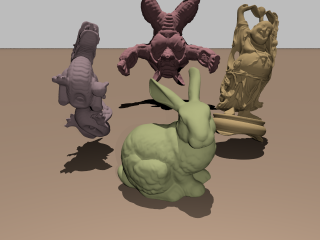
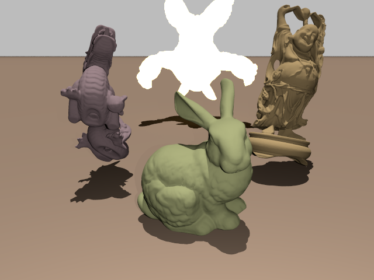
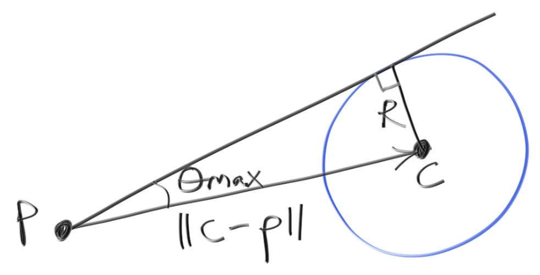
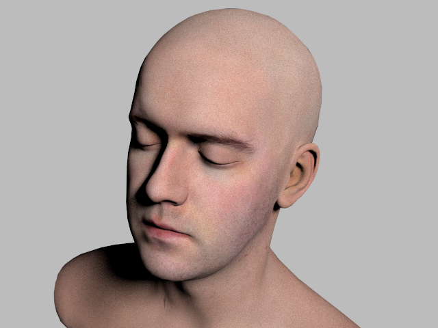

# HW3 Submission

@author [Thomaswnag0822](https://github.com/Thomaswang0822)

## Design My Own Scene

### Location

[Scene file](scenes/cbox_armadillo_areaLight/cbox_aramadillo_areaLight.xml)

### Design

I cheated a little bit. I spent too much time on other Bonus parts. And I just reused my
"Aramadillo in Cornell Box" from last HW and turn it into area light.

### Rendering

512 x 512


## Bonus: Schlick Fresnel vs actual Fresnel

The speaker Naty Hoffman first gives a brief overview of the history of Fresnel Equation.
Then he introduces the famous Schlick approximation (and its Generalized version). Around Schlick-Fresnel, he brought up several other approaches trying to model Fresnel Equation better.
I'd like to skip those details, but the conclusion is most of them is NOT as efficient as Schlick-Fresnel if we consider both accuracy and computation cost.

I highly agree with his point. Personally, I don't really like the feeling of sqeezing very hard and getting only marginal, even unperceivable, accuracy improvement. Instead, I like the focus on computational efficiency, because this leaves room for real-time rendering, which has a great potential in many fields. Anyway, that amount of subtle accuracy diffence will be overwhelmed by the
imperfection of human eyes.

## Bonus: Stratification

I have implemented stratification sampling for both Sphere and Triangle.

### Sphere Stratification

For a sphere, note that the elevation angle $\theta$ is independent of azumith angle $\phi$.
And a quite intuitive stratification strategy arises: we simply divide the $\phi$ "axis"; that is,
we divide the range of $2\pi$ into n equally-spaced intervals. Less formally, we sample a point on
each "orange slice" of the "orange sphere".

The implementation detail of this is in BVH_node::sphereLight_contribution() for-loop and
the helper function helper::Sphere_sample() it calls.

**Rendering**: on the top is baseline version, on the bottom is 6-strata-per-sphere sampling.
We can clearly seen the artifact brought by those tiny black dots becomes less visible.


### Triangle Stratification

For a triangle, getting the second barycentric component does depending on the first component, so I cannot simply divide along any axis alone. But again, I used a quite natual heuristic: we connect 3 mid points of a triangle and divided it into 4 equal-area sub-triangles. Following this, when we look at one triangle and want to sample its contribution, instead of sampling a single point, we sample 4 points, one from each sub-triangle.

The implementation isn't quite hard. We still get the barycentric $b_1, b_2$ in the same way. Instead of blending the 3 vertices of the outer triangle, we calculate the vertices of the sub-triangle we pick and blend in exactly the same way. The implementation detail is in BVH_node::meshLight_total_contribution() the inner for-loop and the helper function helper::Triangle_sample() it calls.

**Rendering**: using the cbox area light scene, there is no visible difference between the 2 renderings, though the color distribution diagrams (by tev image) are slightly different. First is baseline, on the right is stratified sampling.


## Bonus: Sample One Light at a Time

My heuristic is that sampling one light a time can be extremely helpful when a complex triangle mesh is an area light. Say we want to render a scene with a glowing bunny with thousands or millions of triangles. Without this technique, we would have to sample N (mesh size) triangles EACH TIME a single ray hit a single diffuse shading point. I've tried to turn off this strategy and the rendering is computationally impossible. The progress reporter never moves.

To summarize, I created additional data in a `TriangleMesh` struct. It's a vector of accumulated triangle area normalized over mesh total surface area. E.g, if a `TriangleMesh` contains 4 triangles
of area 1, 3, 4, 2 each, normalize over 10 and accumulate them sequentially, we get [0.1, 0.4, 0.8, 1.0]. This act as a Cumulative Density Function (cdf) of a discrete distribution. And we use the classical statsitic method to sample from it.

I will paste the docstring of relevant functions below. Implementation details are in the functions.

```cpp
/**
 * @brief Compute the total SCALED contribution from an area-light TriangleMesh.
 * Sampling from mesh (alternative to looking at all Triangles) has been implemented.
 * It will be activated if sampleAll == true && mesh size >= maxSample
 * 
 * @note Each time we sample a point x_i from Triangle_i, the p(x) is just 1/area_i.
 *   Here we "expect" small contribution from each Triangle sum up to the total contribution
 *   of the mesh, so we don't take the average.
 * @note If we sample from mesh first, the probability of a Triangle_i being picked is
 *   its normalized area (area_i/mesh_surface_area). So overall, the p(x) = Prob(pick Triangle_i 
 *   from mesh) * Prob(pick x_i from Triangle_i) = area_i/mesh_surface_area * 1/area_i = 
 *   1/mesh_surface_area. In this sense, we "expect" each single sampling point to represent
 *   the total contribution from the mesh. Thus, we take the average at last. Quite counter-intuitive.
 * @note number of samples we really take is min(mesh.size(), maxSample). i.e. if the mesh only has
 *   16 Triangles, we take 16 samples instead of 64.
 * 
 * @param Kd diffuse surface reflectance at the hitting point
 * @param I area light radiance
 * @param sampleAll user defined flag of whether to sample lights
 *   (instead of looking at all lights in the mesh)
 * @param maxSample max number of light samples we pick from the mesh, default to 64
 * @param stratified whether use strafitied sampling. See helper::Triangle_sample()
 * 
 * @return Vector3 
 */
Vector3 meshLight_total_contribution(Scene& scene, Hit_Record& rec, BVH_node& root,
            int mesh_id, int shape_id,
            const Vector3& Kd, const Vector3& I,
            curandState& rng, 
            bool sampleAll=true, int maxSample=64,
            bool stratified=false);
```

```cpp
// TriangleMesh struct
    TriangleMesh(const ParsedTriangleMesh& pMesh) :
        ShapeBase{pMesh.material_id, pMesh.area_light_id},
        positions(pMesh.positions), indices(pMesh.indices), 
        normals(pMesh.normals), uvs(pMesh.uvs),
        size((int)pMesh.indices.size()),
        areaCDF(pMesh.indices.size() + 1, 0.0)
    {
        // areaCDF will be populated in Scene constructor after
        // all Triangles are created
    }

    // given a Unif(0,1), return it's corresponding sample triangle
    int which_tri(double rd) {
        // upper_bound because we want
        // [0, 0.4, 0.8, 1.0] searching 0.4 should gives 1
        auto it = std::upper_bound(areaCDF.begin(), areaCDF.end(), rd);
        std::size_t index = std::distance(areaCDF.begin(), it - 1);
        return static_cast<int>(index);
    }
```

**Rendering**: I used that most-challenging party scene and turned Armadillo into a area-light mesh.
Rather than rendering quality, this technique improves rendering efficiency and can turn impossible rendering like this into a possible one. Here is the log and the rendering:

```powershell
# Original party scene
$ ./torrey -hw 3_4 ../scenes/party/party.xml 
Scene parsing done. Took 0.4228 seconds.
ParsedScene Copied to myScene. Took 0.694218 seconds.
BVH tree built. Took 19.2695 seconds.
 100.00 Percent Done (1200 / 1200)
Parallel Raytracing takes: 2.02484 seconds.

# turn Armadillo into a area-light mesh, 64 samples per mesh
$ ./torrey -hw 3_4 ../scenes/party_arealight/party.xml 
Scene parsing done. Took 0.408834 seconds.
ParsedScene Copied to myScene. Took 0.683027 seconds.
BVH tree built. Took 18.5748 seconds.
 100.00 Percent Done (1200 / 1200)
Parallel Raytracing takes: 419.412 seconds.
```

From top to bottom, they are baseline version, area-light version, and image difference.





## Bonus: More Efficient Spherical Light Sampling

This part is quite tricky, and the confusion comes from the choice of $\theta_{max}$. Both PBRT book and RTRYL book use the angle between Vector{shading point, sphere center} and tagent Vector as $\theta_{max}$.



Later I realized that this is on the "sample unit direction at shading point" standpoint. But what we use is the "sample position on an surface (area light)". Thus, instead, I chose another $\theta_{max}$ that fits better to our context.


I will quote the Piazza post by myself as the implmentation idea. The detail is in `#pragma region ConeSampling` of BVH_node::sphereLight_contribution() and the helper function helper::Sphere_sample() it calls.

"We draw 2 tangent lines to enclose a spherical cap area (that red cap), which is the part of the surface we want to sample from. And $\theta_{max}$ is just the elevation angle in a tilted local space of the sphere. Finally, the xyz we get is actually the point in the upright local space of the sphere. So we transform it back to the world space."

For the last step, I defined a small helper struct Basis and used this function

```cpp
    /**
     * @brief Given a normalized vector, use it as up vector
     *   and generate a orthonormal basis
     * 
     * @param v_up 
     * @return Basis 
     */
    static Basis orthonormal_basis(Vector3 v_up)
```

**Rendering**: on the left is baseline; on the right is cone sampling. To be honest, the rendering is less statisfying. The shadow becomes even "harder".




## Bonus: More Efficient Triangle Light Sampling

I haven't finished this part. I think I understand the idea presented in the paper. And that pseudocode block is particularly helpful. I got stuck on getting basic geometric information of a
spherical triangle. For now, I cannot compute the interal angles $\alpha, \beta, \gamma$.

Here is the helper struct I created. I will finish this and submit it with HW4.

```cpp
/**
 * @brief Spherical triangle on a unit sphere
 * 
 */
struct SphTriangle {
    Vector3 A,B,C;  // vertices
    double area;
    double alpha, beta, gamma;  // internal angles
    double a,b,c;  // edge lengths

    SphTriangle(const Triangle* tri, Vector3 center) {
        Vector3 oA = normalize(tri->p0 - center);
        Vector3 oB = normalize(tri->p0 - center);
        Vector3 oC = normalize(tri->p0 - center);
        // Find vertices
        A = center + oA;
        B = center + oB;
        C = center + oC;

        // Find edge lengths: they are represented by 
        // "by the lines connecting the vertices 
        // to the center of the sphere."
        a = acos(dot(oB, oC));
        b = acos(dot(oA, oC));
        c = acos(dot(oA, oB));

        // TODO: Find internal angles

        // Find area
        area = alpha + beta + gamma - c_PI;
    }
};
```
